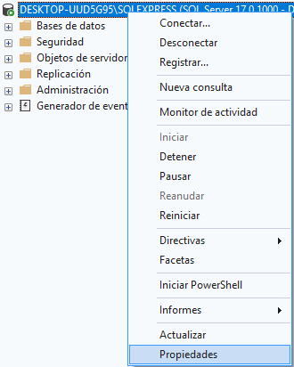
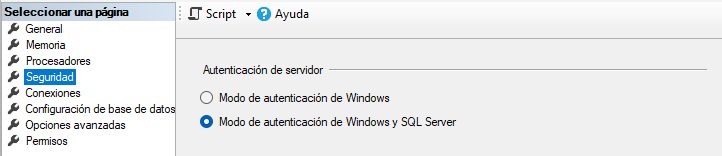
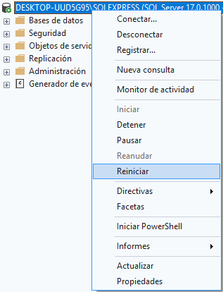
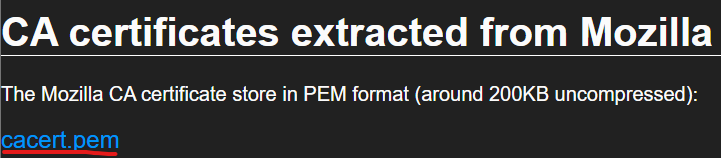
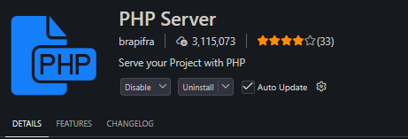
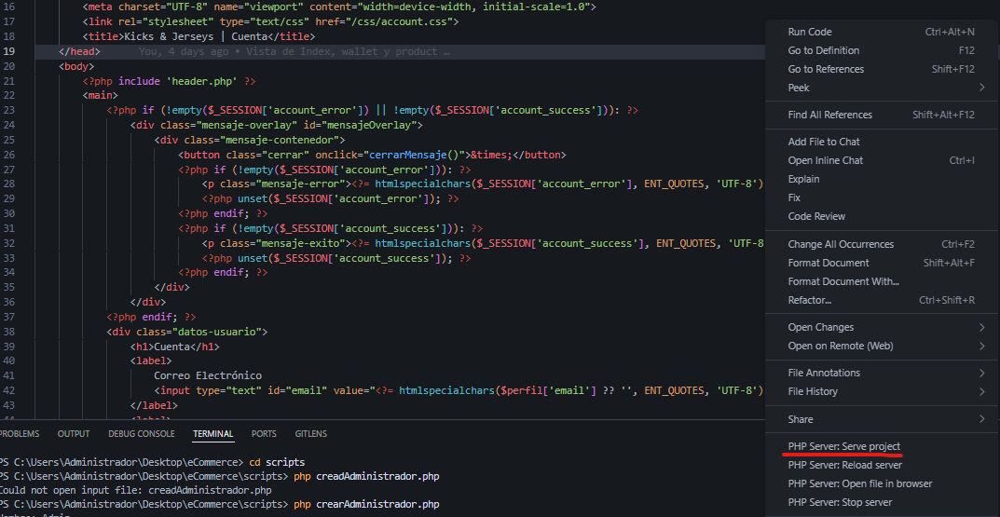

# Configuración

1. Se deben de ejecutar todos los archivos de \db antes de ejecutar la aplicación: DDL.sql, DML.sql y userCredentials.sql
	1. userCredentials será un usuario compartido para facilitar la compatibilidad entre equipos
2. En el archivo dentro de \model llamado connection.php se debe de cambiar la línea 9:
	1. $server = "<nombre_servidor>"
	2. El resto de líneas no se deben de cambiar
3. Para que SQL Server detecte el perfil compartido creado en userCredentials se deberá de:

Click derecho sobre el servidor y elegir propiedades.

Ir al apartado de Seguridad y seleccionar la opción de autenticación de Windows y SQL Server. Después dar click en Aceptar.

Finalmente dan click derecho sobre el servidor y pulsan reiniciar.

# API

Para que las APIs puedan funcionar es necesario realizar lo siguiente:
1. En el archivo php.ini, ubicado en la carpeta de php (o php-8.5.6-Win32-vs17-x64, dependiendo de como lo instalaron), deben de realizar lo siguiente:
	1. Cambiar ;extension=curl a extension=curl (se quita el punto y coma del inicio)
2. Deberán instalar el siguiente archivo: https://curl.se/docs/caextract.html

Dan click en cacert.pem y mueven el archivo a la carpeta de php, en el mismo directorio del documento php.ini

3. Nuevamente en el archivo php.ini deben de cambiar lo siguiente:
	1. ;curl.cainfo = a curl.cainfo = "<ruta_del_archivo_cacert.pem>" (se quita el punto y coma y se pone la ruta del archivo cacer.pm entre comillas dobles, por ejemplo, en mi caso es: "C:\Program Files\php-8.5.6-Win32-vs17-x64\cacert.pem")
	2. ;openssl.capath= a openssl.capath="<ruta_del_archivo_cacert.pem>" (se quita el punto y coma y se pone la ruta del archivo cacer.pm entre comillas dobles)
4. En el archivo model/codigoPostal.php deben de cambiar la línea 3, $apiKey = '', poniendo entre las comillas la clave de API que les di.

# Crear Usuario de Administrador
1. En el cmd (consola de comandos), deben de ir a la carpeta scripts, dentro de esta ejecutarán el siguiente comando:
	php creadAdministrador.php
2. Llenan los datos que les piden y con este podrán acceder a la pantalla de dashboard.php
3. ¡Importante!, solo se puede hacer desde la consola de comandos, no desde el servidor

# Ejecución fuera de IIS
Para ejecutar el servidor se debe de posicionar en la carpeta raíz del proyecto, luego, en la consola de comandos (cmd) se escribe el siguiente comando: 
php -S localhost:5000

Al acceder al enlace a través de un navegador les saldrá un error (es normal), para navegar a la vista de login deberán de poner en la URL:
http://localhost:5000/view/loginRegister.php

Alternativamente pueden instalar la extensión de Visual Studio Code de PHP Server

Dentro de algún archivo de la carpeta view, dan click derecho en el editor y selecciona la opción de Serve Project

